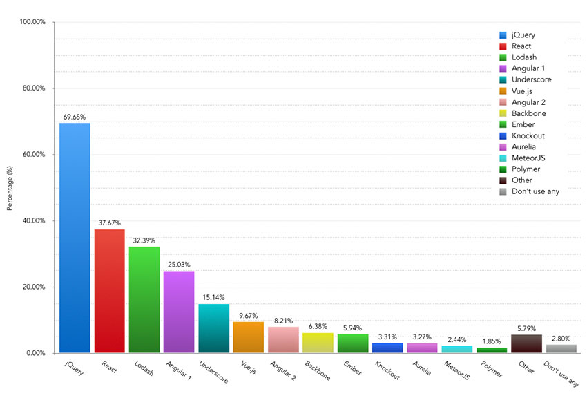
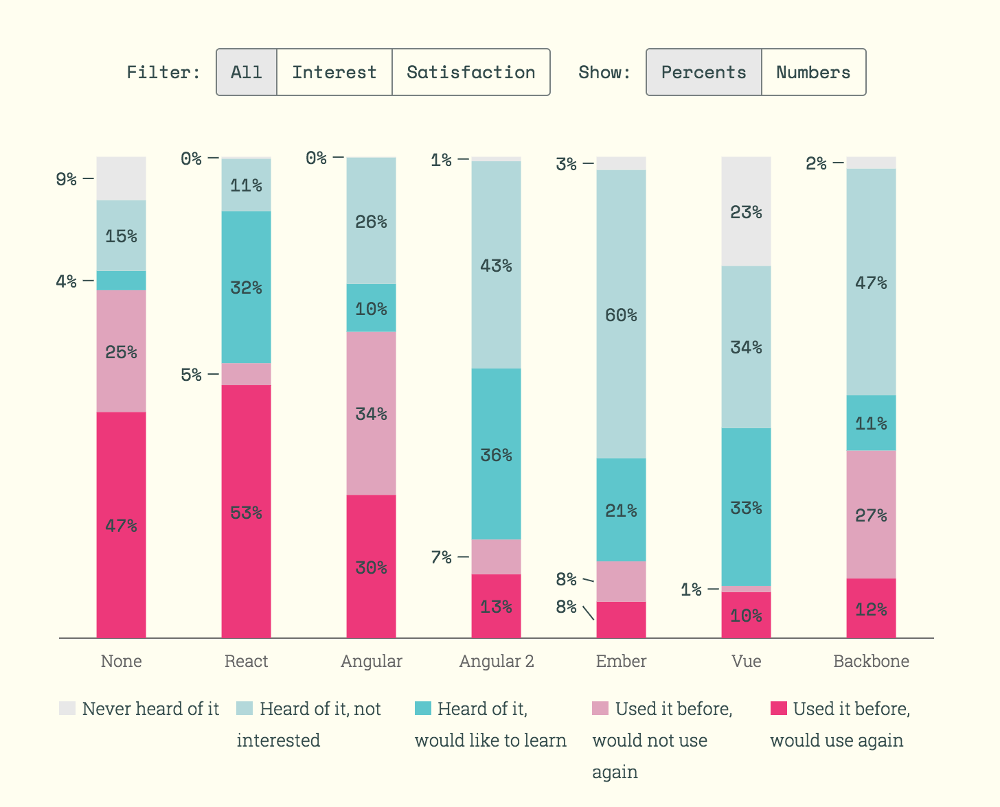
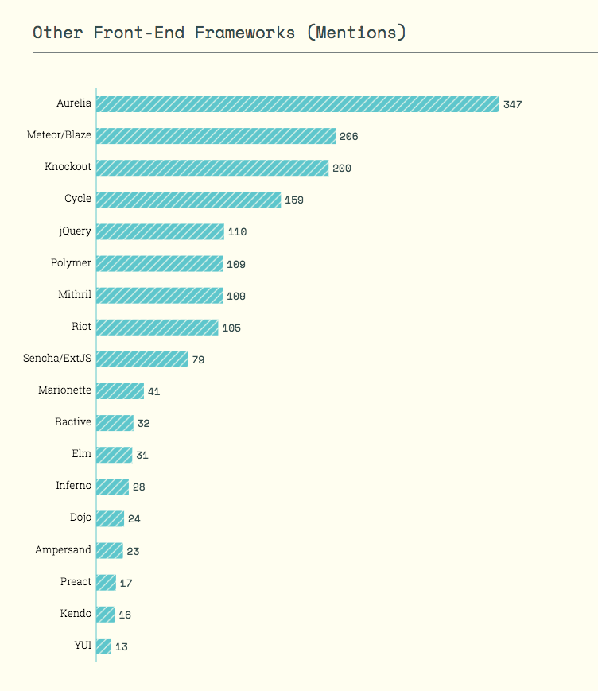

# Learn Front-End Application Architecture

##### General Learning: [^1] 

* [JavaScript Application Design](https://www.amazon.com/JavaScript-Application-Design-Build-Approach/dp/1617291951?&_encoding=UTF8&tag=frontend-handbook-20&linkCode=ur2&linkId=4dd15b53493d3b5148af2b3e5488e98d&camp=1789&creative=9325) [read][$]
* [Programming JavaScript Applications](http://chimera.labs.oreilly.com/books/1234000000262/index.html) [read]

##### Deprecated Learning Materials:

* [Build an App with React and Ampersand](http://learn.humanjavascript.com/react-ampersand) [watch]
* [Building Modern Single-Page Web Applications](https://frontendmasters.com/courses/modern-web-apps/) [watch][$]
* [Eloquent JavaScript: Modules](http://eloquentjavascript.net/10_modules.html) [read]
* [Field Guide to Web Applications](http://www.html5rocks.com/webappfieldguide/toc/index/) [read]
* [Frontend Guidelines Questionnaire](https://github.com/bradfrost/frontend-guidelines-questionnaire) [read]
* [Human JavaScript](http://read.humanjavascript.com/) [read]
* [Nicholas Zakas: Scalable JavaScript Application Architecture](https://www.youtube.com/watch?v=vXjVFPosQHw) [watch]
* [Organizing JavaScript Functionality](https://frontendmasters.com/courses/organizing-javascript/) [watch][$]
* [Patterns for Large-Scale JavaScript Application Architecture](http://addyosmani.com/largescalejavascript/) [read]
* [Terrific](http://terrifically.org/) [read]
* [UI Architecture](http://www.pluralsight.com/courses/web-ui-architecture) [watch][$]
* [Web UI Architecture](https://frontendmasters.com/courses/web-ui-architecture/) [watch][$]

***

###### NOTES:

Not a lot of general content is being created on this topic as of late. Most of the content offered for learning how to build front-end/SPA/JavaScript applications presupposes you've decided up a tool like Angular, Ember, React, or Aurelia.

***

###### ADVICE:

[^1] In 2017 learn [Webpack](https://webpack.js.org/), [React](https://facebook.github.io/react/), and [Redux](http://redux.js.org/). Start with, ["A Complete Intro to React"](https://btholt.github.io/complete-intro-to-react/) and ["Building Applications with React and Redux in ES6"](https://app.pluralsight.com/library/courses/react-redux-react-router-es6/table-of-contents).

***

###### SURVEY RESULTS:

The images below are from the [2016 Frontend Tooling Survey](https://ashleynolan.co.uk/blog/frontend-tooling-survey-2016-results) (4715 developers) and [2016 State of JS Survey](http://stateofjs.com/) (9307 developers)

<cite>Image source: <a href="https://ashleynolan.co.uk/blog/frontend-tooling-survey-2016-results">https://ashleynolan.co.uk/blog/frontend-tooling-survey-2016-results</a></cite>

<cite>Image source: <a href="http://stateofjs.com/">http://stateofjs.com/</a></cite>

<cite>Image source: <a href="http://stateofjs.com/">http://stateofjs.com/</a></cite>

 

