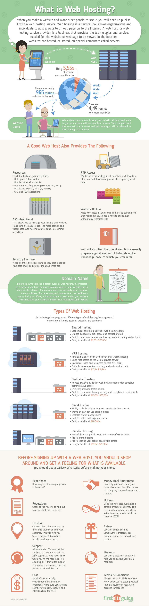

# Learn Web Hosting

> A web hosting service is a type of Internet hosting service that allows individuals and organizations to make their website accessible via the World Wide Web. Web hosts are companies that provide space on a server owned or leased for use by clients, as well as providing Internet connectivity, typically in a data center. Web hosts can also provide data center space and connectivity to the Internet for other servers located in their data center, called colocation, also known as Housing in Latin America or France.

><cite>&#8212; [Wikipedia](https://en.wikipedia.org/wiki/Web_hosting_service)</cite>

<cite>Image source: <a href="http://www.alphaelite.com.sg/sitev2/images/stories/webhostdemo.jpg">http://www.alphaelite.com.sg/sitev2/images/stories/webhostdemo.jpg</a></cite>

##### General Learning:

* [Web Hosting Services Explained](https://firstsiteguide.com/web-hosting/) [read]
* [Web Hosting 101: Get Your Website Live on the Web in No Time](https://www.udemy.com/web-hosting-101/) [video]

<cite>Image source: <a href="https://firstsiteguide.com/wp-content/uploads/2016/06/what-is-web-hosting-infographic.jpg">https://firstsiteguide.com/wp-content/uploads/2016/06/what-is-web-hosting-infographic.jpg</a></cite>

 

