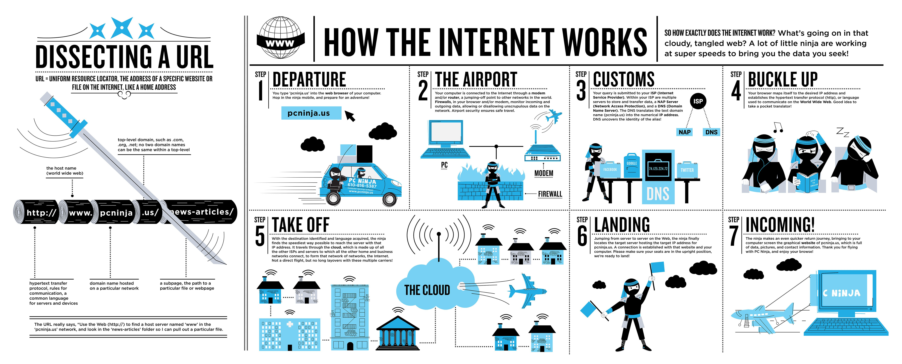
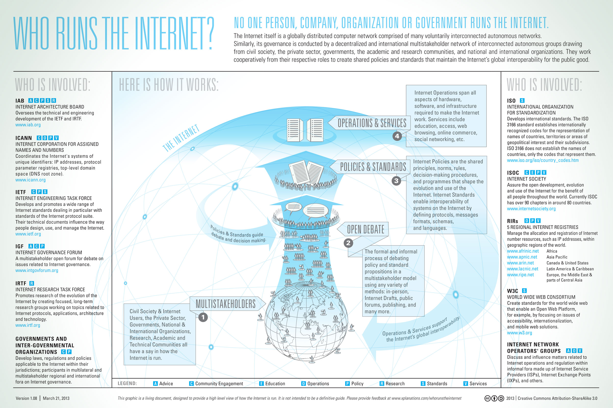

# Learn Internet/Web

> The Internet is a global system of interconnected computer networks that use the Internet protocol suite (TCP/IP) to link several billion devices worldwide. It is a network of networks that consists of millions of private, public, academic, business, and government networks of local to global scope, linked by a broad array of electronic, wireless, and optical networking technologies. The Internet carries an extensive range of information resources and services, such as the inter-linked hypertext documents and applications of the World Wide Web (WWW), electronic mail, telephony, and peer-to-peer networks for file sharing.

><cite>&#8212; [Wikipedia](https://en.wikipedia.org/wiki/Internet)</cite>

<cite>Image source: <a href="https://www.helloitsliam.com/2014/12/20/how-the-internet-works-infographic/">https://www.helloitsliam.com/2014/12/20/how-the-internet-works-infographic/</a></cite>

* [What is the Internet?](https://www.youtube.com/watch?v=Dxcc6ycZ73M) [watch]
* [How the Web works](https://developer.mozilla.org/en-US/docs/Learn/Getting_started_with_the_web/How_the_Web_works) [read]
* How does the Internet work? [https://developer.mozilla.org/en-US/docs/Learn/Common_questions/How_does_the_Internet_work](https://developer.mozilla.org/en-US/docs/Learn/Common_questions/How_does_the_Internet_work) and 
[http://web.stanford.edu/class/msande91si/www-spr04/readings/week1/InternetWhitepaper.htm](http://web.stanford.edu/class/msande91si/www-spr04/readings/week1/InternetWhitepaper.htm) [read]
* [How the Internet Works](https://www.khanacademy.org/partner-content/code-org/internet-works) [watch]
* [How the Internet Works in 5 Minutes](https://www.youtube.com/watch?v=7_LPdttKXPc) [watch]
* [How the Web Works](https://www.eventedmind.com/classes/how-the-web-works-7f40254c) [watch]
* [What Is the Internet? Or, "You Say Tomato, I Say TCP/IP"](http://www.20thingsilearned.com/en-US/what-is-the-internet/1) [read]
* [Don’t Fear the Internet](http://www.dontfeartheinternet.com/)

<cite>Image source: <a href="http://www.bitrebels.com/technology/find-out-who-runs-the-internet-chart/">http://www.bitrebels.com/technology/find-out-who-runs-the-internet-chart/</a></cite>
