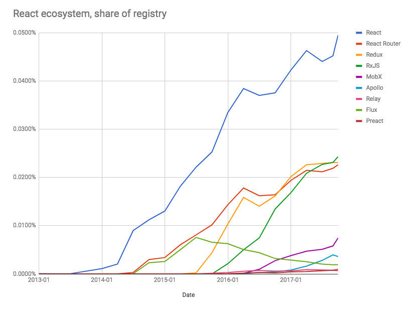

# Learn React

##### Learning React:

* [The Beginner's Guide to ReactJS](https://egghead.io/courses/the-beginner-s-guide-to-reactjs) [read]
* [React.js Introduction For People Who Know Just Enough jQuery To Get By](http://chibicode.com/react-js-introduction-for-people-who-know-just-enough-jquery-to-get-by/) [read]
* [13 things you need to know about React](http://aimforsimplicity.com/post/13-things-you-need-to-know-about-react/) [read]
* [Tutorial: Intro To React](https://facebook.github.io/react/tutorial/tutorial.html) [read]
* [ReactJS For Stupid People](http://blog.andrewray.me/reactjs-for-stupid-people/) [read]
* [Complete Intro to React, v3 (feat. Redux, Router & Flow)](https://frontendmasters.com/courses/react/) [watch][$]
* [React 🎄](https://react.holiday/) [read]
* [React Enlightenment](https://www.reactenlightenment.com/) [read]
* [REACT JS TUTORIAL #1 - Reactjs Javascript Introduction & Workspace Setup](https://www.youtube.com/watch?v=MhkGQAoc7bc&t=6s) [watch]
* [React For Beginners](https://ReactForBeginners.com) [watch][$]

##### Mastering React:

* [Build Your First Production Quality React App](https://egghead.io/courses/build-your-first-production-quality-react-app) [watch][$]
* [Advanced React Component Patterns](https://egghead.io/courses/advanced-react-component-patterns) [watch][$]
* [React Patterns](https://reactpatterns.com/) [read]
* [8 Key React Component Decisions](https://medium.freecodecamp.org/8-key-react-component-decisions-cc965db11594) [read]
* [React + Mobx codebase containing real world examples (CRUD, auth, advanced patterns, etc) that adheres to the RealWorld spec and API.](https://github.com/gothinkster/react-mobx-realworld-example-app) [code]
* [An Introduction to React Router v4 and its Philosophy Toward Routing](https://medium.freecodecamp.org/react-router-v4-philosophy-and-introduction-730fd4fff9bc) [read]

***

###### NOTES:

Once you have a good handle on React move on to learning a more robust state management solution like [MobX](https://mobx.js.org/). If you are an experienced developer with Functional Programming knowledge look at [Redux](https://redux.js.org/). If you need help understanding the role of state management beyond React's `setState` watch, "[Advanced State Management in React (feat. Redux and MobX)](https://frontendmasters.com/courses/react-state/)".

Note below the trends in the React Ecosystem (from npm registry) as you move past React and learn tools that work alongside React.

