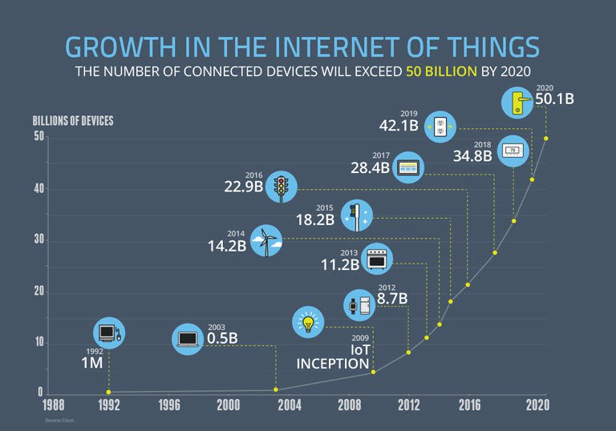

# Front-End Developers Develop For...
# 前端开发者开发了什么

A front-end developer crafts HTML, CSS, and JS that typically runs on the [web platform](http://tess.oconnor.cx/2009/05/what-the-web-platform-is)
(e.g. a web browser) delivered from one of the following operating systems (aka OSs):

一个前端开发者编写 HTML，CSS 和 JS 一般运行在由以下操作系统（又名 OSs）发布的 web 平台上（例如网页浏览器）：

* Android
* Chromium 
* iOS
* OS X
* Ubuntu (or some flavor of Linux)
* Windows Phone
* Windows

These operating systems typically run on one or more of the following devices:

这些操作系统一般运行在以下列出的一个或者多个设备上：

* Desktop computer
* Laptop / netbook computer
* Mobile phone
* Tablet
* TV
* Watch
* [Things](https://en.wikipedia.org/wiki/Internet_of_things) (i.e., anything you can imagine, car, refrigerator, lights, thermostat, etc.)
* 台式电脑
* 笔记本电脑 / 上网笔记本电脑
* 手机
* 平板电脑
* 电视
* 手表
* [其他设备](https://en.wikipedia.org/wiki/Internet_of_things) (例如, 任何你能想象的物品，车，冰箱，灯，恒温器，等等)


<cite>Image source: <a href="https://www.enterpriseirregulars.com/104084/roundup-internet-things-forecasts-market-estimates-2015/">https://www.enterpriseirregulars.com/104084/roundup-internet-things-forecasts-market-estimates-2015/</a></cite>

<cite>图片来源：<a href="https://www.enterpriseirregulars.com/104084/roundup-internet-things-forecasts-market-estimates-2015/">https://www.enterpriseirregulars.com/104084/roundup-internet-things-forecasts-market-estimates-2015/</a></cite>

Generally speaking, front-end technologies can run on the aforementioned operating systems and devices using the following run time web platform scenarios:

一般来说，前端技术可以应用在前面提到的以下使用实时 web 平台的操作系统和设备上：

* A web browser (examples: [Chrome, IE, Safari, Firefox](http://outdatedbrowser.com/en)).
* A [headless browser](https://en.wikipedia.org/wiki/Headless_browser) (examples: [phantomJS](http://phantomjs.org/)).
* A [WebView](http://developer.telerik.com/featured/what-is-a-webview/)/browser tab (think iframe) embedded within a native application as a runtime with bridge to native APIs. WebView applications typically contain a UI constructed from web technologies. (i.e., HTML, CSS, and JS). (examples: [Apache Cordova](https://cordova.apache.org/), [NW.js](http://nwjs.io/), [Electron](http://electron.atom.io/))
* A native application built from web tech that is interpreted at runtime with a bridge to native APIs. The UI will make use of native UI parts (e.g., iOS native controls) not web technologies. (examples: [NativeScript](https://www.nativescript.org/), [React Native](https://facebook.github.io/react-native/))
* web 浏览器 (例如: [Chrome, IE, Safari, Firefox](http://outdatedbrowser.com/en)).
* [无界面浏览器](https://en.wikipedia.org/wiki/Headless_browser) (例如: [phantomJS](http://phantomjs.org/)).
* [WebView](http://developer.telerik.com/featured/what-is-a-webview/)/browser tab（比如 iframe）作为运行环境。它嵌入到原生应用之中，并能够桥接原生APIs接口。WebView 应用一般包含一个由 web 技术开发的图形界面 (例如, HTML, CSS, and JS). (例如: [Apache Cordova](https://cordova.apache.org/), [NW.js](http://nwjs.io/), [Electron](http://electron.atom.io/))
* 通过 web 技术构建的原生应用，其在运行时通过桥接原生 APIs 进行解析。图形界面将借用原生的图形界面（例如, iOS native controls）而不是web技术。(例如: [NativeScript](https://www.nativescript.org/), [React Native](https://facebook.github.io/react-native/))

 

