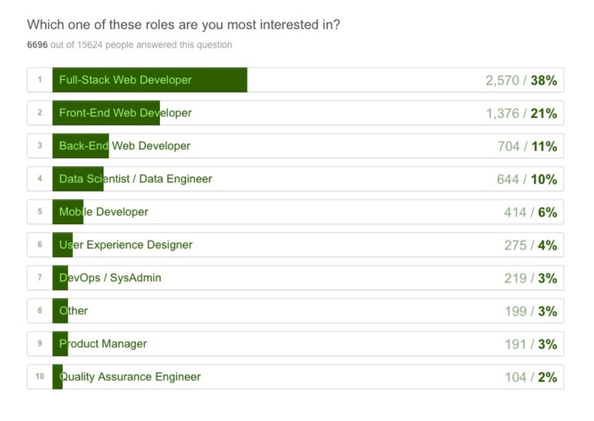
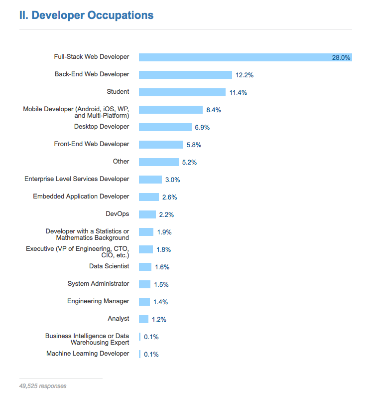

# Generalist/Full-Stack Myth
# 通用/全栈的神话

<cite>图片来源：<a href="http://andyshora.com/full-stack-developers.html">http://andyshora.com/full-stack-developers.html</a></cite>

The roles required to design and develop a web solution require a deep skill set and vast experience in the area of visual design, UI/interaction design, [front-end development](https://github.com/kamranahmedse/developer-roadmap#-front-end-roadmap), and [back-end development](https://github.com/kamranahmedse/developer-roadmap#-back-end-roadmap). Any person who can fill one or more of these 4 roles at a professional level is an extremely rare commodity.

能够设计和实现一个 Web 解决方案的角色，需要在视觉设计，UI/交互设计，[前端开发](https://github.com/kamranahmedse/developer-roadmap#-front-end-roadmap)和[后端开发](https://github.com/kamranahmedse/developer-roadmap#-back-end-roadmap)领域有深厚的技术沉淀和丰富的经验。任何能够达到上述四个角色中的一个或者多个的专家级水平，是一件极其罕见的事情。

Pragmatically, you should seek to be, or seek to hire, an expert in one of these roles (i.e. Visual Design, Interaction Design/IA, Front-end Dev, Back-end Dev). Those who claim to operate at an expert level at one or more of these roles are exceptionally rare and more than likely mythical.

在实际生活中，你应当寻求去成为，或者雇佣一个上述角色中的专家（例如，视觉设计，交互设计/IA，前端开发，后端开发）。那些声称在一个或者多个角色中有专家级别的操作的人很罕见，而且更可能是虚构的。

However, given that JavaScript has infiltrated all layers of a technology stack (e.g. React, node.js, express, couchDB, gulp.js etc...) finding a full-stack JS developer who can code the front-end and back-end is becoming less mythical. Typically, these full stack developers only deal with JavaScript. A developer who can code the front-end, back-end, API, and database isn't as absurd as it once was (excluding visual design, interaction design, and CSS). Still mythical in my opinion, but not as uncommon as it once was. Thus, I wouldn't recommend a developer set out to become a "full stack" developer. In rare situations it can work. But, as a general concept for building a career as a Front-end Developer, I'd focus on front-end technologies.

不管怎样，鉴于 JavaScript 已经渗透到技术栈的各个层面（例如 React，node.js，express，couchDB，gulp.js etc...）以至于找到一个能够同时编写前端和后端代码的全栈JS开发者变得没有那么困难。一般来讲，这些全栈开发者只和JavaScript打交道。一个能够编写前端代码，后端代码，API 和数据库的开发者不再像以前一样荒谬（包括视觉设计，交互设计和 CSS）。但我觉得仍然是很困难的，只是不再像以前那样不平常。因此，我不建议一个开发者立志成为一个全栈开发者。在极少的情况下，它是可行的。但是，根据通常的构建前端开发者职业生涯的概念上，我会只关注前端技术。

***

###### 说明:

The term "Full-Stack" developer has come to take on several meanings. So many, that not one meaning is clear when the term is used. Just consider the results from the two surveys shown below. These results would lead one to believe that the majority of developers are full-stack developers. But, in my almost 20 years of experience, this is anything but the case.

“全栈”开发者这个词已经具备了多种含义。太多的情况，这个词在使用的时候没有一个意思是明确的。请考虑下面展示的两项调查的结果。这些结果会让人相信大多数开发人员都是全栈开发人员。但是，在我20年的经验里，这是不对的。

<cite>图片来源：<a href="https://medium.freecodecamp.com/we-asked-15-000-people-who-they-are-and-how-theyre-learning-to-code-4104e29b2781#.ngcpn8nlz">https://medium.freecodecamp.com/we-asked-15-000-people-who-they-are-and-how-theyre-learning-to-code-4104e29b2781#.ngcpn8nlz</a></cite>

<cite>图片来源：<a href="https://insights.stackoverflow.com/survey/2017#developer-profile-specific-developer-types">https://insights.stackoverflow.com/survey/2017#developer-profile-specific-developer-types</a></cite>

 

