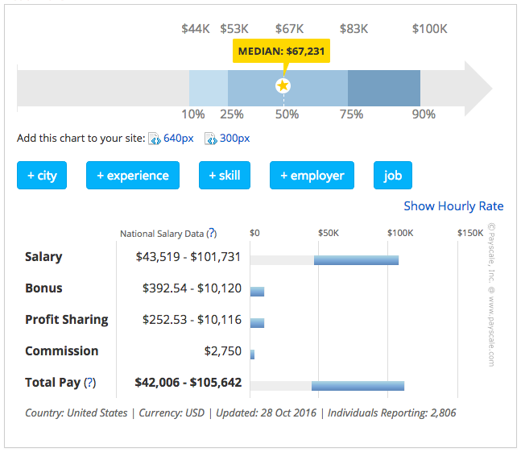

# Front-End Salaries

The national average in the U.S for a mid-level front-end developer is around [$75k](http://www.glassdoor.com/Salaries/front-end-web-developer-salary-SRCH_KO0,23.htm). Of course when you first start expect to enter the field at around 35k depending upon location and portfolio.

<cite>Image source: <a href="http://intersog.com/blog/chicago-tech-salary-guide-2015/">http://intersog.com/blog/chicago-tech-salary-guide-2015/</a></cite>

***

###### NOTES:

A lead/senior front-end developer/engineer can potentially live wherever they want (i.e., work remotely) and make over $150k a year (visit [angel.co](https://angel.co/jobs), sign-up, review front-end jobs over $150k or examine the salary ranges on [Stack Overflow Jobs](https://stackoverflow.com/jobs?q=front-end&sort=y)).

 

