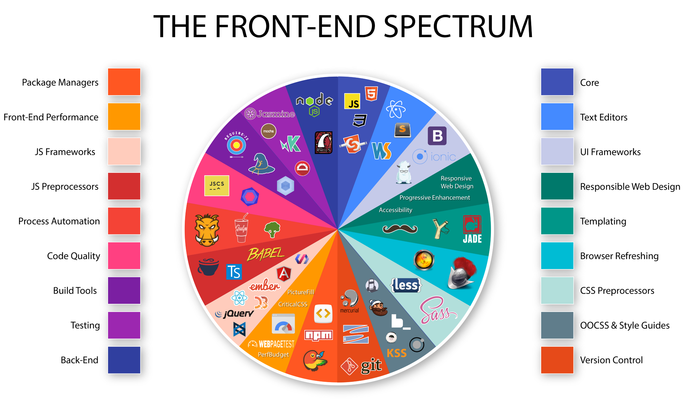

# Part III: Front-end Developer Tools

Part three briefly explains and identifies tools of the trade.

Make sure you understanding the category that a set of tools falls within, before studying the tools themselves.

Note that just because a tool is listed, or a category of tools is documented, this does not equate to an assertion on my part that a front-end developer should learn it and use it. Choose your own toolbox. I'm just providing the common toolbox options.

<cite>Image source: <a href="https://medium.com/@withinsight1/the-front-end-spectrum-c0f30998c9f0">https://medium.com/@withinsight1/the-front-end-spectrum-c0f30998c9f0</a></cite>

