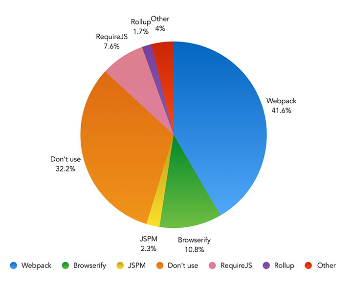

# Module Loading/Bundling Tools 

* [Browserify](http://browserify.org/)
* [Rollup](http://rollupjs.org/)
* [SystemJS](https://github.com/systemjs/systemjs)
* [webpack](https://webpack.js.org/)
  * [http://www.webpackbin.com/](http://www.webpackbin.com/)

***

###### SURVEY RESULTS:

The images below are from the [2016 Frontend Tooling Survey](https://ashleynolan.co.uk/blog/frontend-tooling-survey-2016-results) (4715 developers) and [2016 State of JS Survey](http://stateofjs.com/) (9307 developers)

<cite>Image source: <a href="https://ashleynolan.co.uk/blog/frontend-tooling-survey-2016-results">https://ashleynolan.co.uk/blog/frontend-tooling-survey-2016-results</a></cite>

<cite>Image source: <a href="http://stateofjs.com/">http://stateofjs.com/</a></cite>

<cite>Image source: <a href="http://stateofjs.com/">http://stateofjs.com/</a></cite>

 

