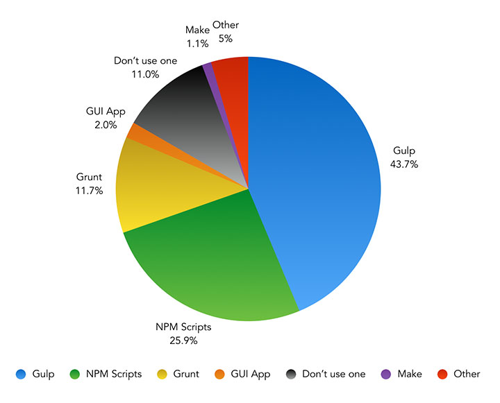
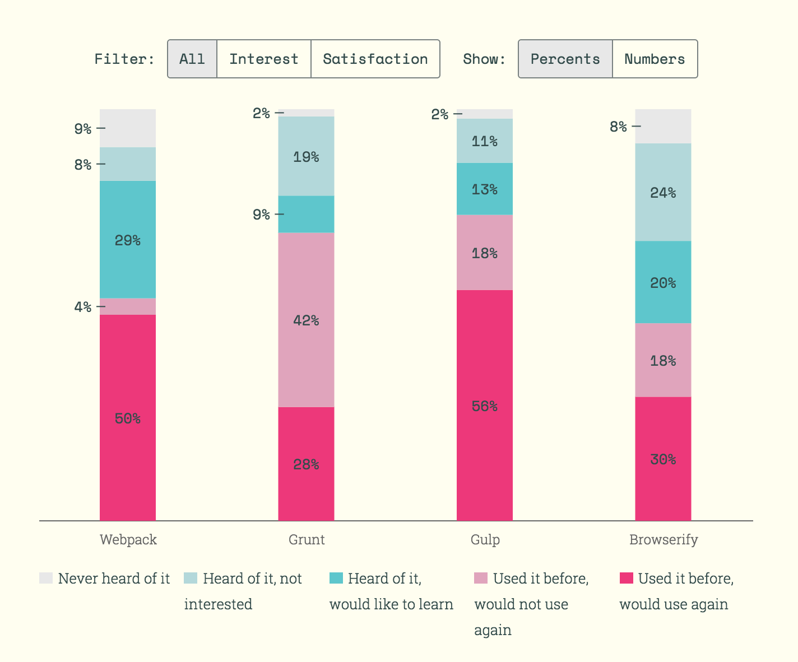
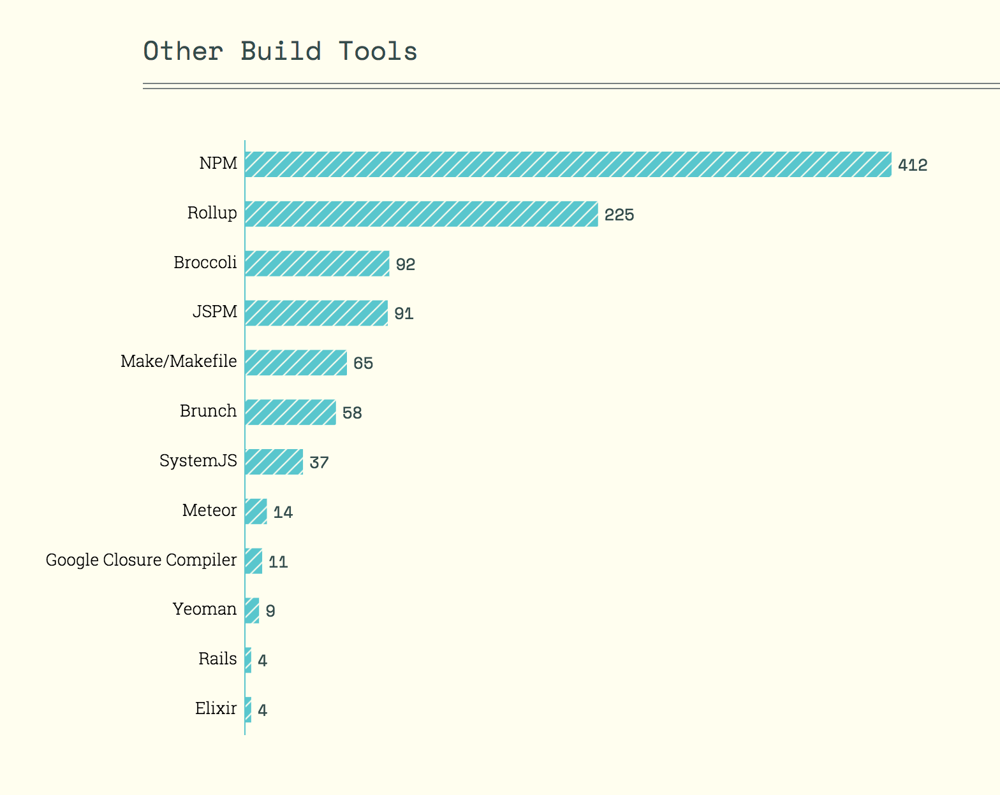

# Tasking (aka Build) Tools 

##### Tasking/Build Tools: [^1]

* [Gulp](http://gulpjs.com/)
* [Broccoli.js](http://broccolijs.com/)

##### Opinionated Tasking/Build pipeline tools:

* [Brunch](http://brunch.io/)
* [Mimosa](http://mimosa.io/)
* [Lineman](http://linemanjs.com/)

***

###### ADVICE:

[^1] Before reaching for Gulp make sure [npm scripts](https://docs.npmjs.com/misc/scripts) or [yarn script](https://yarnpkg.com/en/docs/package-json#toc-scripts) won't fit the bill. Read, ["Why I Left Gulp and Grunt for npm Scripts"](https://medium.freecodecamp.com/why-i-left-gulp-and-grunt-for-npm-scripts-3d6853dd22b8#.nw3huib54).

***

###### SURVEY RESULTS:

The images below are from the [2016 Frontend Tooling Survey](https://ashleynolan.co.uk/blog/frontend-tooling-survey-2016-results) (4715 developers) and [2016 State of JS Survey](http://stateofjs.com/) (9307 developers)

<cite>Image source: <a href="https://ashleynolan.co.uk/blog/frontend-tooling-survey-2016-results">https://ashleynolan.co.uk/blog/frontend-tooling-survey-2016-results</a></cite>

<cite>Image source: <a href="http://stateofjs.com/">http://stateofjs.com/</a></cite>

<cite>Image source: <a href="http://stateofjs.com/">http://stateofjs.com/</a></cite>

 

