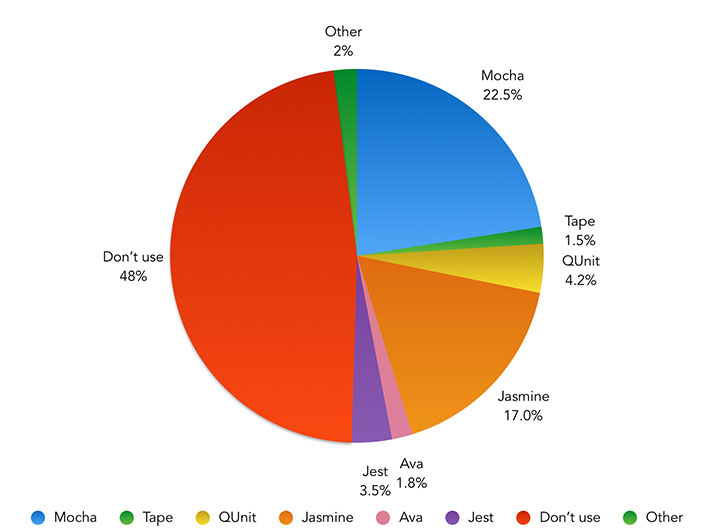
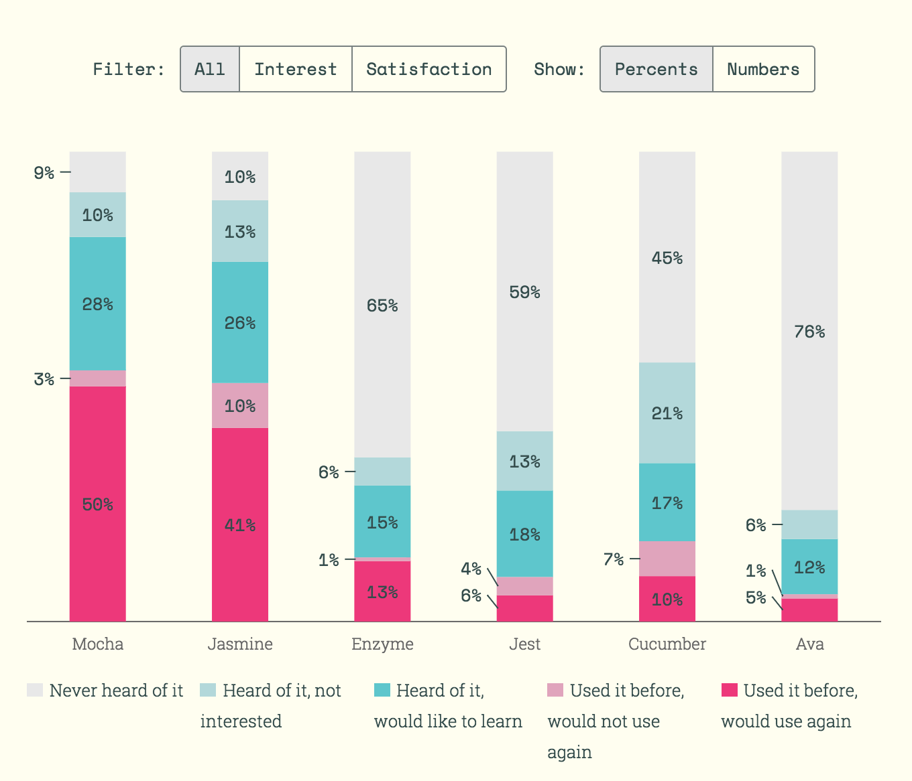
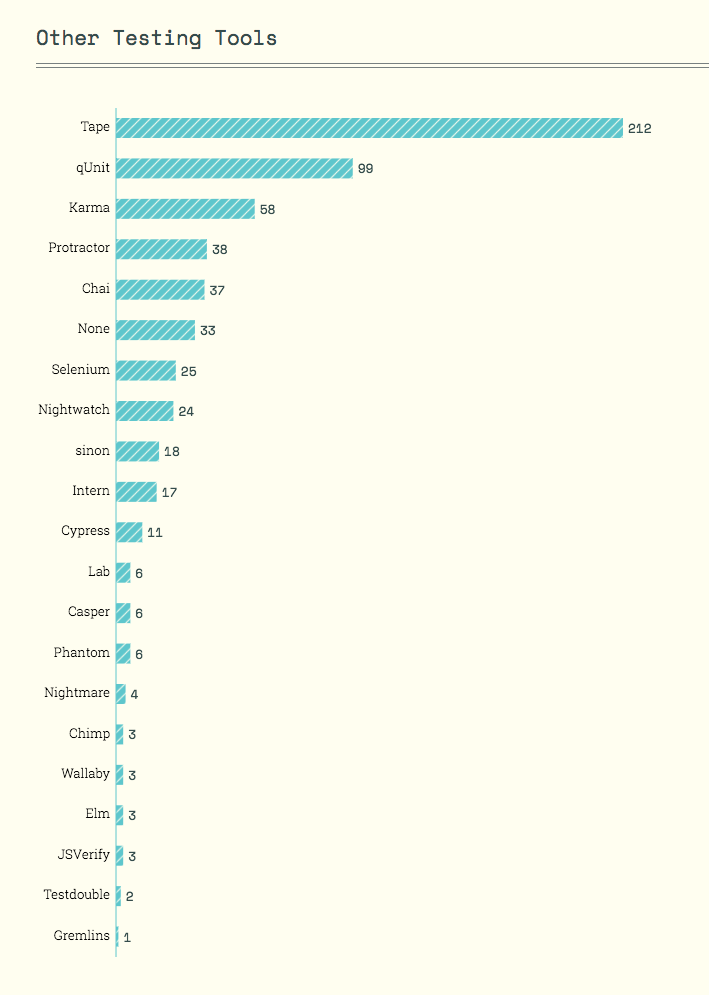

# Testing Tools

##### Software Testing Frameworks:

* [Intern](https://theintern.github.io/)
* [Karma](http://karma-runner.github.io/1.0/index.html)
* [Jest](http://facebook.github.io/jest/)

##### Unit Testing:

* [AVA](https://github.com/avajs/ava)
* [Jasmine](http://jasmine.github.io/)
* [Mocha](http://mochajs.org/)
* [Tape](https://github.com/substack/tape)

##### Testing Assertions for Unit Testing:

* [Chai](http://chaijs.com/)
* [expect.js](https://github.com/Automattic/expect.js)
* [should.js](http://shouldjs.github.io/)

##### Test Spies, Stubs, and Mocks for Unit Testing:

* [sinon.js](http://sinonjs.org/)
* [Kakapo.js](http://devlucky.github.io/kakapo-js)

##### Hosted Testing/Automation for Browsers:

* [Browserling](https://www.browserling.com/) [$]
* [BrowserStack](https://www.browserstack.com) [$]
* [CrossBrowserTesting.com](http://crossbrowsertesting.com/) [$]
* [Nightcloud.io](http://nightcloud.io/)
* [Sauce Labs](https://saucelabs.com/) [$]

##### Browser Automation:

* [CasperJS](http://casperjs.org/)
* [Nightmare](https://github.com/segmentio/nightmare)
* [TestCafe](https://github.com/DevExpress/testcafe)

##### UI Testing Tools:

* [gremlins.js](https://github.com/marmelab/gremlins.js)
* [Percy](https://percy.io)
* [BackstopJS](https://github.com/garris/BackstopJS)
* [PhantomCSS](https://github.com/Huddle/PhantomCSS)
* [Ghost Inspector](https://ghostinspector.com/)
* [diff.io](https://diff.io/)

##### Automated dead link and error detectors:
* [Monkey Test It](https://monkeytest.it/)

***

###### NOTES:

Testing frameworks typically offer more tools than just unit testing. If you are looking for JavaScript unit testing solutions look at [JavaScript Tools](https://frontendmasters.gitbooks.io/front-end-handbook-2017/content/tools/js.html).

***

###### SURVEY RESULTS:

The images below are from the [2016 Frontend Tooling Survey](https://ashleynolan.co.uk/blog/frontend-tooling-survey-2016-results) (4715 developers) and [2016 State of JS Survey](http://stateofjs.com/) (9307 developers)

<cite>Image source: <a href="https://ashleynolan.co.uk/blog/frontend-tooling-survey-2016-results">https://ashleynolan.co.uk/blog/frontend-tooling-survey-2016-results</a></cite>

<cite>Image source: <a href="http://stateofjs.com/">http://stateofjs.com/</a></cite>

<cite>Image source: <a href="http://stateofjs.com/">http://stateofjs.com/</a></cite>

